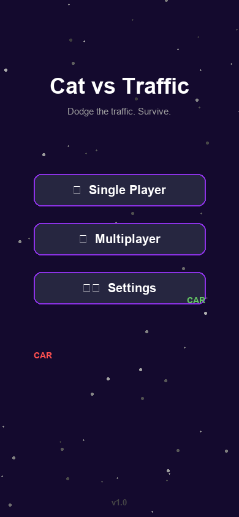
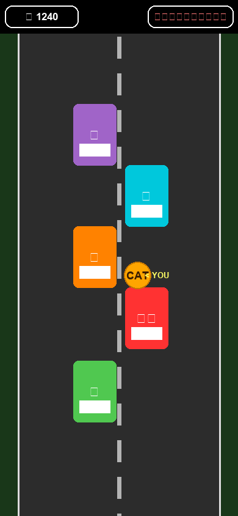
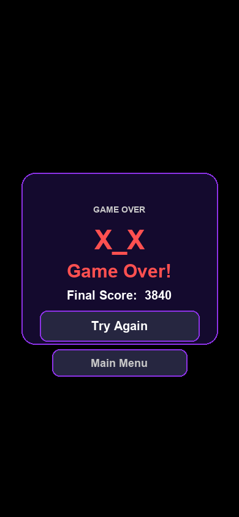

<div align="center">

# 🐱 Cat vs Traffic

### A fast-paced multiplayer cat survival game for iOS

[](https://developer.apple.com/ios/)
[](https://swift.org)
[](https://developer.apple.com/spritekit/)
[](https://developer.apple.com/documentation/multipeerconnectivity)
[](LICENSE)

<br>

```
      🚗  🚕  🏎️  🚙
         
    🚗      🚗      🚌
    
         🐱          ← You
    
    🚕  🏎️     🚗
    
      🚗    🚙   🚕
```

*Dodge the traffic. Survive. Beat your friends.*

<br>

[**Download**](#installation) • [**Gameplay**](#gameplay) • [**Multiplayer**](#multiplayer) • [**Features**](#features)

</div>

---

## 🎮 What is Cat vs Traffic?

**Cat vs Traffic** is a thrilling top-down survival game where you guide your cat 🐱 through an endless stream of oncoming vehicles. Every car has its own **personality and driving behavior** — cautious drivers slow down, aggressive ones swerve toward you, and reckless ones blast through at full speed.

With **real-time local multiplayer** via Multipeer Connectivity, you and nearby friends can play together on the same road — sharing the chaos.

---

## 📸 Screenshots

<div align="center">

| Menu | Gameplay | Game Over |
|:---:|:---:|:---:|
|  |  |  |
| *Animated cars & cats roam the background menu* | *Dodge 9 behavior-driven traffic cars* | *Stylish game-over panel with score* |

</div>

> 📱 *Screenshots taken on iPhone 15 Pro — supports all modern iOS screen sizes*

---

## ✨ Features

### 🚦 9 Unique Car Personalities
Each car on the road has a distinct AI behaviour — watch out for them all:

| Behavior | Color | Description |
|:---:|:---:|---|
| 🟢 Cautious | Green | Slows down when it sees you |
| 🟡 Polite | Yellow | Stops and tries to change lanes — eventually gives up |
| 🔴 Aggressive | Red | Actively steers toward you |
| 🟠 Impatient | Orange | Randomly swerves and speeds up |
| 🩵 Distracted | Cyan | Unpredictably slows and wanders |
| 🟣 Reckless | Magenta | Always at full speed, no mercy |
| 🤎 Lazy | Brown | Barely moving — a slow moving obstacle |
| 🟣 Tailgater | Purple | Locks on and follows close behind |
| 🔵 Rubberneck | Blue | Nearly stopped — a frustrating road blocker |

### 🐱 Gameplay
- **Touch or Accelerometer** controls — choose your style in Settings
- **9 lives** (shown as ❤️ hearts in the HUD)
- Score climbs every second you survive
- **Hit feedback**: red screen flash, camera shake, and spark particles on collision
- Smooth **lane-change AI** — cars overtake each other in real-time

### 🎨 Polished Visuals
- Dark gradient road with **animated scrolling lane markings**
- **Speed lines** streaking down the road for motion feel
- Emoji car sprites with windshields, headlights, and behavior icons
- Idle **engine bob** animation on every car
- Animated 🐱 cat player with idle bounce
- Frosted-glass HUD panels
- Slide-in **Game Over screen** with animated 💀 skull

### 👥 Local Multiplayer
- Up to **4 players** on the same local network (WiFi/Bluetooth)
- **Multipeer Connectivity** — no internet required, no accounts needed
- Authority-based sync: one device drives all traffic, others receive updates
- See other players' cats in real-time — watch them get hit!
- Connected player names shown live in the HUD

---

## 🕹️ Gameplay

```
┌─────────────────────────────────┐
│  🏅 1240      👥 Player2   ❤️❤️❤️  │  ← HUD Bar
├─────────────────────────────────┤
│  🟢│                      │     │
│    │  🚙  Cautious         │     │  ← Grass shoulder
│    │                       │     │
│    │     🏎️ Reckless       │     │
│    │                       │     │
│    │  🐱  ← YOU            │     │
│    │                       │     │
│    │  🚗  Aggressive       │     │
│    │                       │     │
│    │  🚕  Distracted  🚗   │     │
│    │                       │     │
└─────────────────────────────────┘
```

**Controls:**
- 👆 **Touch Mode** — drag your finger to move the cat
- 📱 **Accelerometer Mode** — tilt your device to steer

Change controls anytime in **⚙️ Settings**.

---

## 📡 Multiplayer

Cat vs Traffic uses Apple's **MultipeerConnectivity** framework for zero-setup local multiplayer — no accounts, no internet, no server.

```
 iPhone 1 (Host)          iPhone 2 (Guest)
 ┌──────────────┐          ┌──────────────┐
 │  🐱 You      │◄────────►│  🐱 Friend   │
 │  🚗🚙🏎️      │  Bluetooth│              │
 │  Traffic AI  │  or WiFi  │  Traffic sync│
 └──────────────┘          └──────────────┘
```

**How to play multiplayer:**
1. Open the app on two iPhones near each other
2. One player taps **👥 Multiplayer** → the game auto-connects
3. Both devices see the same traffic — dodge together!

---

## 📲 Installation

### Requirements
- iOS 16.0+
- Xcode 15+
- iPhone or iPad

### Build from Source
```bash
git clone https://github.com/BaccioOFDeath/MultiplayerCatGame.git
cd MultiplayerCatGame
open MultiplayerCatGame.xcodeproj
```

Then hit **▶ Run** in Xcode. No dependencies, no package manager — pure Apple frameworks only.

---

## 🏗️ Tech Stack

| Component | Technology |
|---|---|
| Game Engine | **SpriteKit** |
| AI / Behaviors | Custom `OpponentManager` with 9 behavior types |
| Multiplayer | **MultipeerConnectivity** (P2P, no server) |
| Controls | **UITouch** + **CoreMotion** accelerometer |
| Visuals | `SKShapeNode`, `SKLabelNode`, `SKAction` animations |
| Architecture | Scene-based (`MenuScene`, `GameScene`, `LobbyScene`, `SettingsScene`) |

---

## 📁 Project Structure

```
MultiplayerCatGame/
├── GameScene.swift          # Main gameplay — road, player, HUD, collisions
├── MenuScene.swift          # Animated main menu
├── LobbyScene.swift         # Multiplayer lobby
├── SettingsScene.swift      # Controls settings
├── OpponentManager.swift    # Traffic AI — 9 behavior types, lane changes
├── CarBehavior.swift        # Behavior enum, colors, speed/steer factors
├── MCManager.swift          # MultipeerConnectivity networking
├── VisualFactory.swift      # Shared visual helpers (gradient, buttons, nodes)
├── CGPoint+Extensions.swift # lerp() for smooth interpolation
└── CustomSKView.swift       # SpriteKit view setup
```

---

## 🎯 Roadmap

- [ ] 🏆 High score leaderboard (Game Center)
- [ ] 🌙 Night mode / weather effects
- [ ] 🐾 Unlockable cat skins
- [ ] 💥 Power-ups (shield, slow-mo, magnet)
- [ ] 🗺️ Multiple road environments
- [ ] 📊 Post-game stats screen

---

## 📄 License

This project is licensed under the MIT License — see [LICENSE](LICENSE) for details.

---

<div align="center">

Made with ❤️ and lots of 🐱 by **BaccioOFDeath**

*If a car hits you, that's not a bug — that's the Aggressive driver doing its job.*

⭐ Star this repo if you survived more than 30 seconds!

</div>
